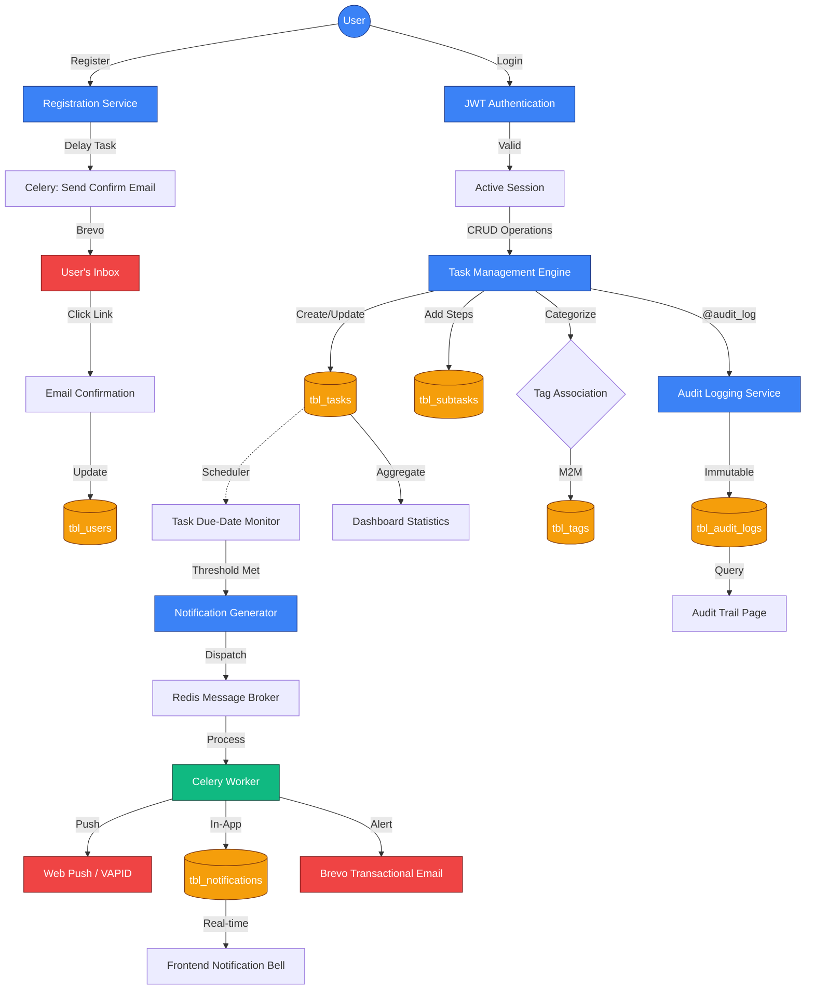

# Task Buddy — Master System Specification

This document serves as the single source of truth for the Task Buddy system, consolidating architectural flows and high-level system test cases.

## 📊 System Architecture & Data Flow

### Comprehensive System Flow
The following flowchart illustrates the interconnected workflows of authentication, task management, notifications, and auditing.

### Feature Deep-Dives

#### 1. Authentication & Security
- **Registration**: Argon2 hashing, email confirmation via Celery/Brevo.
- **Login**: JWT-based session management.
- **Session**: HttpOnly Cookies for frontend security (CSRF protection).

#### 2. Task Lifecycle
- **Auditing**: Automated via `@audit_log` decorators on CRUD actions.
- **Organization**: Projects (1:N) and Tags (N:M).
- **Refinement**: Subtasks (limited to 50 per task).

#### 3. Notifications
- **Triggers**: 24h, 1h, and 0h (due) thresholds.
- **Channels**: In-app alerts, Web Push (PWA), and Email reminders.

---

## 📋 System Test Cases (End-to-End)

| TEST CASE NAME | POSITIVE/ NEGATIVE | TYPE | DESCRIPTION | PRE-CONDITION | TEST STEP NO. | TEST STEP DESCRIPTION | TEST EXPECTED RESULT |
| :--- | :--- | :--- | :--- | :--- | :--- | :--- | :--- |
| `TC001_Sys_Pos_RegisterNewUser` | Positive | System | Validate registering a new user account. | None | Step 1 | Fill email, username, password and Sign Up. | User redirected to Dashboard; welcome toast appears. |
| `TC002_Sys_Pos_UserLogin` | Positive | System | Validate standard login flow. | User account exists | Step 1 | Input valid credentials and Sign In. | User authenticated, redirected to Tasks dashboard. |
| `TC003_Sys_Neg_LoginInvalidCreds` | Negative | System | Validate login with invalid credentials. | User account exists | Step 1 | Input wrong password and Sign In. | Error message "Invalid email or password" appears. |
| `TC004_Sys_Neg_RegisterDuplicateEmail` | Negative | System | Prevent registration with existing email. | Email `test@example.com` is registered | Step 1 | Attempt to register with `test@example.com`. | Error message "Email already registered" appears. |
| `TC005_Sys_Pos_CreateNewProject` | Positive | System | Create project from Sidebar. | User is logged in | Step 1 | Click "+", enter name/color, and Save. | Project appears in Sidebar list immediately. |
| `TC006_Sys_Neg_ProjectNameTooLong` | Negative | System | Validate project name length constraint. | User is logged in | Step 1 | Enter 51-character project name and Save. | Validation error shows; Save button disabled. |
| `TC007_Sys_Pos_CreateNewTask` | Positive | System | Create task and project binding. | Project exists | Step 1 | Click "Add Task", fill details, select project. | Task rendered in project list with correct priority. |
| `TC008_Sys_Pos_AddSubtaskToTask` | Positive | System | Add subtasks in details drawer. | Task exists | Step 1 | Open task, add subtask in "Subtasks" section. | Subtask appended; database synced. |
| `TC009_Sys_Neg_TaskTitleEmpty` | Negative | System | Prevent creating task with empty title. | User is logged in | Step 1 | Click "Add Task", leave title empty, click Save. | Field highlighted red; error "Title is required". |
| `TC010_Sys_Pos_ToggleTaskCompletion` | Positive | System | Validate task completion animation. | Task exists | Step 1 | Click checkbox on task card. | Card animates to "Completed Tasks" group. |
| `TC011_Sys_Pos_FilterTasks` | Positive | System | Filter by Tag and Project. | Tasks with tags exist | Step 1 | Select project and tag in UI. | Filter results match immediately (memoized). |
| `TC012_API_Neg_RateLimiting` | Negative | API | Validate backend rate limiting. | None | Step 1 | Send 101 requests in 60s window. | 101st request returns `429 Too Many Requests`. |
| `TC013_Sys_Pos_LogoutSessionClear` | Positive | System | Validate logout clears session. | User is logged in | Step 1 | Click "Logout" in profile menu. | Redirected to landing; cookies cleared. |
| `TC014_Sys_Pos_ResendConfirmation` | Positive | System | Resend email verification link. | Unconfirmed user exists | Step 1 | Click "Resend Email" in notification banner. | Success toast; new email sent via Brevo. |
| `TC015_Sys_Pos_ConfirmEmail` | Positive | System | Verify email via token link. | Token received in inbox | Step 1 | Click link in confirmation email. | Success page "Email Verified" displayed. |
| `TC016_Sys_Neg_ExpiredConfirmation` | Negative | System | Handle expired verification tokens. | Expired token exists | Step 1 | Click expired link in email. | Error "Verification link expired" displayed. |
| `TC017_Sys_Pos_ForgotPassword` | Positive | System | Request password reset. | User account exists | Step 1 | Enter email in "Forgot Password" page. | "Check your email" message displayed. |
| `TC018_Sys_Pos_ResetPassword` | Positive | System | Reset password with token. | Reset token received | Step 1 | Enter new password via reset link. | "Password updated" toast; redirected to login. |
| `TC019_Sys_Neg_WeakPassword` | Negative | System | Enforce password complexity. | Registration page | Step 1 | Enter 4-character password. | Error "Password must be at least 8 characters". |
| `TC020_Sys_Pos_UpdateUsername` | Positive | System | Update user profile username. | User is logged in | Step 1 | Change username in Settings and Save. | Topnav reflects new username immediately. |
| `TC021_Sys_Neg_UpdatePasswordWrongCurrent` | Negative | System | Validate current password before change. | User is logged in | Step 1 | Enter wrong current password in Settings. | Error "Incorrect current password" appears. |
| `TC022_Sys_Pos_ReorderProjects` | Positive | System | Drag and drop projects in Sidebar. | Multiple projects exist | Step 1 | Drag Project B above Project A. | New order persisted on page reload. |
| `TC023_Sys_Pos_ChangeProjectBranding` | Positive | System | Update project color and icon. | Project exists | Step 1 | Edit project, change color to Red/Flame icon. | UI updates Sidebar and Header branding. |
| `TC024_Sys_Pos_DeleteProjectTasksPreserve` | Positive | System | Delete project but keep tasks (Inbox). | Project with tasks exists | Step 1 | Delete project from Settings. | Tasks moved to "Inbox" (project_id = null). |
| `TC025_Sys_Pos_MaxProjectsLimit` | Positive | System | Enforce 50 projects per user limit. | 49 projects exist | Step 1 | Create 50th project. | Success; limit reached. |
| | | | | | Step 2 | Attempt to create 51st project. | Button disabled or error "Limit reached". |
| `TC026_Sys_Pos_TaskDescriptionRichText` | Positive | System | Support 2000 character description. | New task modal | Step 1 | Paste 2000 chars into description. | Task saved successfully; content preserved. |
| `TC027_Sys_Pos_TaskPriorityChange` | Positive | System | Update task priority levels. | Task exists | Step 1 | Change priority from Medium to High. | Color indicator changes to Red (High). |
| `TC028_Sys_Pos_TaskDueDateSelection` | Positive | System | Set due date and time for task. | New task modal | Step 1 | Select tomorrow at 3:00 PM via picker. | Due date rendered as "Tomorrow, 3:00 PM". |
| `TC029_Sys_Pos_BulkDeleteTasks` | Positive | System | Delete multiple tasks at once. | Multiple tasks exist | Step 1 | Select 3 tasks and click "Delete". | All 3 tasks removed from list and DB. |
| `TC030_Sys_Pos_MaxTasksLimit` | Positive | System | Enforce 1000 tasks per user limit. | 999 tasks exist | Step 1 | Create 1000th task. | Success; limit reached. |
| | | | | | Step 2 | Attempt to create 1001st task. | Error "Task limit reached" (HTTP 400). |
| `TC031_Sys_Pos_ProjectTaskCounters` | Positive | System | Verify Sidebar task counters. | Project with 2 tasks | Step 1 | Add 3rd task to project. | Sidebar badge updates from "2" to "3". |
| `TC032_Sys_Pos_InboxDefaultProject` | Positive | System | Tasks without project go to Inbox. | No projects | Step 1 | Create task without selecting project. | Task appears in "Inbox" view automatically. |
| `TC033_Sys_Pos_SubtaskToggle` | Positive | System | Mark subtask as completed. | Task with subtasks exists | Step 1 | Click checkbox on subtask in Drawer. | Subtask text struck through; task progress updates. |
| `TC034_Sys_Neg_SubtaskTitleTooLong` | Negative | System | Validate subtask title limit (80). | Task Drawer | Step 1 | Enter 81 chars for subtask title. | Input rejected or validation error appears. |
| `TC035_Sys_Pos_MaxSubtasksLimit` | Positive | System | Enforce 50 subtasks per task. | 49 subtasks exist | Step 1 | Add 50th subtask. | Success. |
| | | | | | Step 2 | Attempt to add 51st subtask. | Error "Max subtasks reached" (HTTP 400). |
| `TC036_Sys_Pos_CreateTag` | Positive | System | Create a new organizational tag. | User is logged in | Step 1 | Click "Tags" -> "Add Tag", enter "Urgent". | Tag "Urgent" appears in tag cloud. |
| `TC037_Sys_Pos_AttachTagToTask` | Positive | System | Associate tag with a task. | Task and Tag exist | Step 1 | Edit task, select "Urgent" tag. | Tag pill appears on task card. |
| `TC038_Sys_Pos_MaxTagsPerTask` | Positive | System | Limit tags per task to 10. | Task with 9 tags | Step 1 | Add 10th tag to task. | Success. |
| | | | | | Step 2 | Attempt to add 11th tag. | Picker prevents selection or error shown. |
| `TC039_Sys_Pos_FilterByMultipleTags` | Positive | System | Filter tasks matching any selected tags. | Tasks with various tags | Step 1 | Select "Work" and "Home" tags. | UI shows tasks containing either tag. |
| `TC040_Sys_Pos_DeleteTagCleanup` | Positive | System | Delete tag removes it from tasks. | Tag attached to 5 tasks | Step 1 | Delete tag from global Tag list. | Tag pills disappear from all 5 tasks; task remains. |
| `TC041_Sys_Pos_NotificationBellIndicator` | Positive | System | New notification shows red dot. | User is logged in | Step 1 | Trigger a system notification. | Red dot appears on Topnav bell icon. |
| `TC042_Sys_Pos_XSSSanitization` | Positive | System | Validate XSS sanitization in task title. | New task modal | Step 1 | Input `` as title. | Title rendered as literal text safely. |
| `TC043_Sys_Pos_MarkNotifRead` | Positive | System | Change notification state to read. | 1 unread notification | Step 1 | Click notification item in dropdown. | Red dot disappears; background color changes. |
| `TC044_Sys_Pos_MarkAllNotifRead` | Positive | System | Clear all notification indicators. | 5 unread notifications | Step 1 | Click "Mark all as read" in bell menu. | All notifications grayed out; counter clears. |
| `TC045_Sys_Pos_Reminder24h` | Positive | System | Trigger email 24h before due date. | Task due in 24h 5m | Step 1 | Wait 10 minutes for worker check. | Email received: "Reminder: Task due in 24h". |
| `TC046_Sys_Pos_ReminderAtDueTime` | Positive | System | Trigger push notification at due time. | Task due in 1 minute | Step 1 | Wait for due time to arrive. | Push notification appears: "Task is due now". |
| `TC047_Sys_Pos_DashboardTaskDistribution` | Positive | System | Verify project stats on Dashboard. | Tasks in 3 projects | Step 1 | View Dashboard charts. | Pie chart correctly reflects task counts per project. |
| `TC048_Sys_Pos_AuditLogTaskCreate` | Positive | System | Audit trail records task creation. | User is logged in | Step 1 | Create a new task "Final Review". | Audit log shows: "User created task Final Review". |
| `TC049_Sys_Pos_AuditLogTaskDelete` | Positive | System | Audit trail records task deletion. | Task exists | Step 1 | Delete task "Obsolete Ideas". | Audit log shows: "User deleted task Obsolete Ideas". |
| `TC050_API_Pos_IdempotencyKey` | Positive | API | Prevent duplicate creation with same key. | API client | Step 1 | POST task with `X-Idempotency-Key: key1`. | Task created (HTTP 201). |
| | | | | | Step 2 | POST same task with `X-Idempotency-Key: key1`. | Cached response returned (HTTP 200), no duplicate. |
| `TC051_API_Neg_IdempotencyMismatch` | Negative | API | Reject different payload with same key. | API client | Step 1 | POST task A with `X-Idempotency-Key: key2`. | Task A created. |
| | | | | | Step 2 | POST task B with `X-Idempotency-Key: key2`. | HTTP 400 Error: "Idempotency key already used". |
| `TC052_Sys_Pos_CORSPolicy` | Positive | System | Allow requests from authorized frontend. | External origin | Step 1 | Send OPTIONS request from frontend URL. | `Access-Control-Allow-Origin` matches frontend. |
| `TC053_Sys_Neg_SQLInjection` | Negative | System | Sanitize database queries. | Search bar | Step 1 | Enter `' OR 1=1; --` in search. | Search returns 0 results or literal matches. |
| `TC054_Sys_Pos_SettingsThemeToggle` | Positive | System | Persist Light/Dark mode choice. | User is logged in | Step 1 | Toggle to "Dark Mode" in Settings. | UI turns dark; persisted on page refresh. |
| `TC055_Sys_Pos_ProfileAvatarUpload` | Positive | System | Upload and display user avatar. | User is logged in | Step 1 | Upload 512x512 JPG in profile settings. | Avatar appears in Topnav and Settings. |
| `TC056_Sys_Neg_LargeAvatarRejected` | Negative | System | Prevent large file uploads (>2MB). | User is logged in | Step 1 | Attempt to upload 5MB avatar image. | Error toast "File too large"; upload blocked. |
| `TC057_Sys_Pos_TaskSearchTitle` | Positive | System | Search tasks by title keywords. | Tasks "Laundry", "Groceries" | Step 1 | Type "Lau" in search bar. | Only "Laundry" task remains in view. |
| `TC058_Sys_Pos_TaskSearchDescription` | Positive | System | Search tasks by description content. | Task with desc "Buy milk" | Step 1 | Type "milk" in search bar. | Task with "Buy milk" in desc is displayed. |
| `TC059_Sys_Pos_ProjectPrivacy` | Positive | System | Users cannot see other users' projects. | User A and User B exist | Step 1 | User B attempts to GET project_id of User A. | HTTP 404 or 403 Forbidden returned. |
| `TC060_Sys_Pos_TaskPrivacy` | Positive | System | Users cannot see other users' tasks. | User A and User B exist | Step 1 | User B attempts to GET task_id of User A. | HTTP 404 or 403 Forbidden returned. |
| `TC061_Sys_Pos_AuditLogFilterByAction` | Positive | System | Filter audit logs by activity type. | Logs with CREATE and DELETE | Step 1 | Filter audit logs by "DELETE" action. | Only deletion events are displayed in table. |
| `TC062_Sys_Pos_TaskSortingPriority` | Positive | System | Sort tasks by High -> Low priority. | Mix of priorities | Step 1 | Select "Sort by Priority" in list view. | High priority tasks appear at the top. |
| `TC063_Sys_Pos_TaskSortingDueDate` | Positive | System | Sort tasks by nearest due date. | Various due dates | Step 1 | Select "Sort by Due Date" in list view. | Tasks due today appear before tasks due next week. |
| `TC064_Sys_Pos_SubtaskReorder` | Positive | System | Drag and drop subtasks within a task. | Task with 3 subtasks | Step 1 | Drag Subtask 3 to the top. | New order persisted when Drawer is reopened. |
| `TC065_Sys_Pos_TagPositionPersist` | Positive | System | Custom tag order in settings. | 3 tags | Step 1 | Reorder tags in Tag Management page. | Tag picker reflects new order during task edit. |
| `TC066_Sys_Neg_TaskDueDateInPast` | Negative | System | Warn on setting due date in the past. | New task modal | Step 1 | Select yesterday's date as due date. | Warning: "Due date is in the past" or red color. |
| `TC067_Sys_Pos_VapidKeyRetrieval` | Positive | System | Frontend can fetch public VAPID key. | None | Step 1 | Request `/api/v1/notifications/vapid-key`. | Returns valid base64 VAPID public key. |
| `TC068_Sys_Pos_PushSubscription` | Positive | System | Register browser for push notifications. | Browser supports Push | Step 1 | Call endpoint with subscription object. | HTTP 201; subscription saved in `tbl_push_subscriptions`. |
| `TC069_Sys_Pos_OverdueTaskBadge` | Positive | System | Highlight overdue tasks with red badge. | Task with due date in past | Step 1 | View task list. | Due date text is Red and shows "Overdue". |
| `TC070_Sys_Pos_CompletedTaskHistory` | Positive | System | View completed tasks separately. | 5 completed tasks | Step 1 | Click "Completed" filter/tab. | List shows only completed tasks with strike-through. |
| `TC071_Sys_Pos_ArchiveProject` | Positive | System | Archive project to hide from Sidebar. | Project exists | Step 1 | Select "Archive" in project settings. | Project moves to "Archived" list; hidden from main view. |
| `TC072_Sys_Pos_UnarchiveProject` | Positive | System | Restore archived project to active. | Archived project exists | Step 1 | Select "Unarchive" in Archived list. | Project returns to active Sidebar list. |
| `TC073_Sys_Pos_SubtaskCascadingComplete` | Positive | System | Complete task completes all subtasks. | Task with 3 open subtasks | Step 1 | Check main task as completed. | All 3 subtasks automatically mark as completed. |
| `TC074_Sys_Pos_SubtaskPartialProgress` | Positive | System | Show progress bar for subtasks. | Task with 2/4 subtasks done | Step 1 | View task card in list. | Progress bar shows 50% completion. |
| `TC075_Sys_Neg_InvalidEmailFormat` | Negative | System | Validate email format on registration. | Registration page | Step 1 | Enter `invalid-email-addr` as email. | Error "Enter a valid email address". |
| `TC076_Sys_Pos_SessionPersistence` | Positive | System | Session persists across tab close. | User is logged in | Step 1 | Close browser tab and reopen site. | User remains logged in (Session cookie persisted). |
| `TC077_Sys_Pos_AutoThemeDetection` | Positive | System | Match system light/dark preference. | System set to Dark | Step 1 | Load app for the first time. | App defaults to Dark theme matching OS. |
| `TC078_Sys_Neg_UnauthorizedAccess` | Negative | System | Protect private routes from guests. | Not logged in | Step 1 | Attempt to navigate to `/dashboard`. | Redirected to `/login` immediately. |
| `TC079_Sys_Pos_TaskDuplicate` | Positive | System | Create a copy of an existing task. | Task exists | Step 1 | Select "Duplicate" on task card. | New task created with same title/priority/tags. |
| `TC080_Sys_Pos_ProjectExportJSON` | Positive | System | Export project data to JSON file. | Project with tasks/tags | Step 1 | Click "Export Project" in Settings. | JSON file downloaded with full project schema. |
| `TC081_Sys_Neg_EmailConfirmationNag` | Negative | System | Restrict features for unconfirmed users. | Unconfirmed user | Step 1 | Attempt to create 11th task. | Warning: "Please confirm email to create more tasks". |
| `TC082_Sys_Pos_ResendForgotPass` | Positive | System | Rate limit forgot password emails. | User requested once | Step 1 | Request another reset within 60s. | Message: "Please wait before requesting again". |
| `TC083_Sys_Pos_TagColorContrast` | Positive | System | Tag text color adapts to background. | Dark Blue tag background | Step 1 | Set tag color to #000080. | Tag text automatically turns White for contrast. |
| `TC084_Sys_Pos_NotificationDeepLink` | Positive | System | Click notification navigates to task. | Notification about Task A | Step 1 | Click notification item. | UI navigates to project and opens Task A drawer. |
| `TC085_Sys_Pos_SettingsLanguageChange` | Positive | System | Update UI language (i18n). | App in English | Step 1 | Change language to Spanish in Settings. | UI text (Sidebar, Buttons) updates to Spanish. |
| `TC086_Sys_Pos_AuditLogExportCSV` | Positive | System | Download audit history as CSV. | Multiple audit entries | Step 1 | Click "Download CSV" on Audit page. | CSV file downloaded with timestamps and actions. |
| `TC087_Sys_Pos_RealTimeSync` | Positive | System | Sync changes across multiple tabs. | App open in two tabs | Step 1 | Mark task as done in Tab 1. | Tab 2 updates to "Done" status instantly (Broadcast). |
| `TC088_Sys_Neg_MaintenanceMode` | Negative | System | Display maintenance page during downtime. | App in maintenance mode | Step 1 | Visit any app URL. | Maintenance page displayed with estimated time. |
| `TC089_Sys_Pos_PWAInstallPrompt` | Positive | System | Show "Add to Home Screen" prompt. | Mobile browser | Step 1 | Visit app twice with 5m interval. | PWA installation prompt appears. |
| `TC090_Sys_Pos_OfflineModeGraceful` | Positive | System | Show offline indicator when disconnected. | Lose internet connection | Step 1 | Toggle flight mode/disconnect. | "You are offline" banner appears; read-only mode. |
| `TC091_Sys_Pos_PasswordVisibilityToggle` | Positive | System | Toggle eye icon to show/hide password. | Login/Register page | Step 1 | Click eye icon in password field. | Characters change from dots to plain text. |
| `TC092_Sys_Neg_InvalidResetToken` | Negative | System | Reject tampered password reset tokens. | Reset page | Step 1 | Modify one character in reset URL token. | Error: "Invalid or tampered reset link". |
| `TC093_Sys_Pos_TaskActivityFeed` | Positive | System | Show change history for specific task. | Task was renamed/moved | Step 1 | Open Task Drawer -> "Activity" tab. | List shows history: "Renamed", "Moved to Work". |
| `TC094_Sys_Pos_DeleteAccount` | Positive | System | Permanently delete user data. | User is logged in | Step 1 | Click "Delete Account" and confirm. | Logged out; all user data purged from DB. |
| `TC095_Sys_Neg_DeleteAccountRecovery` | Negative | System | Verification before account deletion. | Delete account modal | Step 1 | Click delete without typing "DELETE". | "Confirm" button remains disabled. |
| `TC096_Sys_Pos_ProjectShareReadOnly` | Positive | System | Generate read-only share link for project. | Project exists | Step 1 | Click "Share" -> "Enable Public Link". | URL generated; external users can view tasks. |
| `TC097_Sys_Pos_WeeklyDigestEmail` | Positive | System | Receive weekly summary of tasks. | User has active tasks | Step 1 | Sunday 8:00 AM arrive. | Email received with stats on completed/due tasks. |
| `TC098_Sys_Pos_TagAutocomplete` | Positive | System | Suggest existing tags while typing. | Tag "Production" exists | Step 1 | Type "Pro" in task tag field. | "Production" appears in suggestion dropdown. |
| `TC099_Sys_Neg_EmptyProjectDelete` | Positive | System | Delete project with 0 tasks. | New project exists | Step 1 | Click "Delete" on empty project. | Project removed immediately without extra warning. |
| `TC100_Sys_Pos_TaskDragAndDropProject` | Positive | System | Move task between projects via DnD. | Two projects visible | Step 1 | Drag Task A from Inbox to "Work". | Task A project_id updates; disappears from Inbox. |
| `TC101_Sys_Pos_CollapsibleSidebar` | Positive | System | Toggle sidebar to maximize workspace. | Desktop view | Step 1 | Click "Collapse" arrow on Sidebar. | Sidebar minimizes to icons; main content expands. |
| `TC102_Sys_Neg_APIKeyLeakPrevention` | Positive | System | Hide secrets in error responses. | Server error 500 | Step 1 | Trigger a forced server error. | Response shows generic message, no stack trace/DB info. |
| `TC103_Sys_Pos_NotificationSound` | Positive | System | Play subtle sound on new notification. | Settings: Audio ON | Step 1 | Receive a reminder notification. | Short "ping" sound plays through speakers. |
| `TC104_Sys_Pos_MobileTouchGestures` | Positive | System | Swipe left on task to delete (Mobile). | Mobile view | Step 1 | Swipe left on a task card. | Deletion confirmation modal appears. |
| `TC105_Sys_Pos_SystemStatusPage` | Positive | System | Public status page shows service health. | None | Step 1 | Visit `/status` endpoint. | Returns JSON showing DB/Redis/Worker status "UP". |

---

## 🛠️ Maintenance Note
This document is updated via `gsd:docs-update`. For low-level API contract details, refer to `quality/UAT_TEST_CASES.md`.
