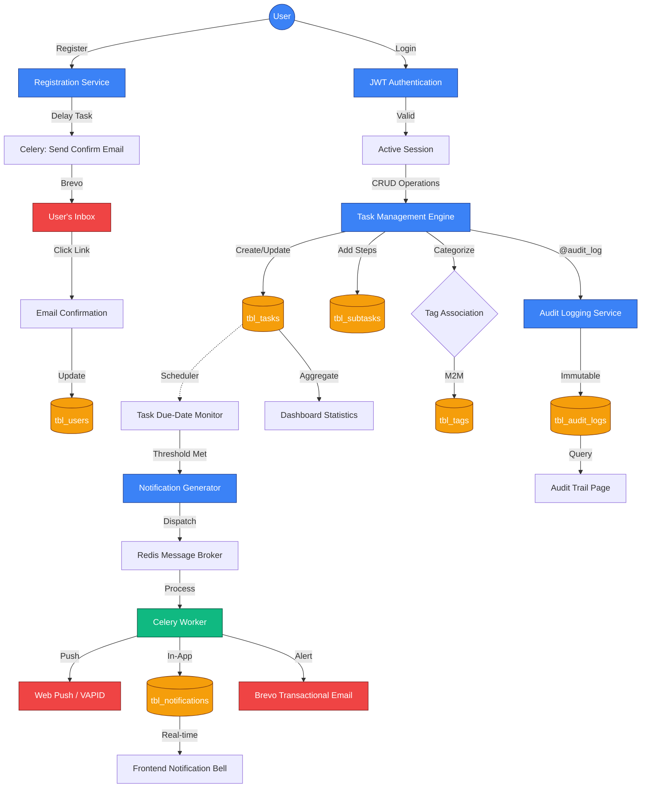

# Task Buddy — System Flowchart (Mermaid)

This document provides a descriptive flowchart of the Task Buddy system, illustrating the interconnected workflows of authentication, task management, notifications, and auditing.

## 📊 Comprehensive System Flow

---

## 🔍 Detailed Feature Flows

### 1. Authentication & Security
1. **Registration**: User submits details. System hashes password (Argon2), saves to `tbl_users`, and enqueues a confirmation email.
2. **Confirmation**: User clicks the email link, setting `confirmed = True`.
3. **Login**: User provides credentials. System verifies hash and returns a JWT access token.
4. **Session**: All subsequent requests include the `Authorization: Bearer <token>` header.

### 2. Task Lifecycle & Auditing
1. **Creation**: User creates a task. The `@audit_log` decorator automatically captures the `CREATE` action.
2. **Organization**: Task is associated with a Project (1:N) and multiple Tags (N:M).
3. **Refinement**: User adds Subtasks for granular tracking.
4. **Completion**: Marking a task as complete triggers another Audit entry and stops pending reminders.

### 3. Notification & Reminder System
1. **Monitoring**: A background process (or scheduled task) monitors `due_date` fields in `tbl_tasks`.
2. **Triggering**: When a task is 24h, 1h, or 0h from its deadline, a notification task is pushed to **Redis**.
3. **Delivery**: **Celery Workers** pick up the task and:
    - Save an in-app alert to `tbl_notifications`.
    - Send a Web Push notification to registered PWA endpoints.
    - Send an email if it's a critical reminder.

### 4. Data Integrity & Reporting
1. **Statistics**: The `Dashboard` queries `tbl_tasks` and `tbl_projects` to calculate completion percentages and project loads.
2. **History**: The `Audit Logs` provide a searchable history of who modified which task and what specific fields changed.
